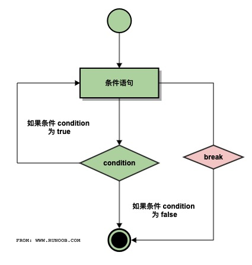

| 名称      | 描述                                           | 使用                                                                           |
|-----------|------------------------------------------------|--------------------------------------------------------------------------------|
| return    | 结束函数，返回参数                             | 程序运行到所遇到的第一个return即返回（退出def块），不会再运行第二个return。    |
| break     | 用来终止循环语句，                             | 用在while和for循环中，跳出所在的当前整个循环，到外层代码继续执行。             |
| continue  | 跳过当前循环的剩余语句，然后继续进行下一轮循环 | continue语句用在while和for循环中，内层循环执行完毕，外层代码继续运行。         |
| exit(num) | 退出整个循环                                   | 可省略的参数。通常情况下0表示程序正常退出，1表示程序遇到了某个错误而导致退出。 |
| pass      | 为了保持程序结构的完整性,不做什么事            | 一般做占位语句                                                                 |

# **1. return**

1. 在函数体中遇到return语句，则结束函数执行（函数体未执行完部分不再执行），
2. 将表达式的值返回到函数调用处。
3. 使用return最多只能返回一个值。

## return后无语句
``` python
def func3():
    for i in range(1,11):
        if i % 2 == 0:
            return i
    # 符合第一个条件的语句，输出并停止。
t = func3()
print(t)
# 输出结果：2
```

## return后有语句，会执行吗？
``` python
def test():
    a = 2
    return a
    s = 3
    print(s)

print(test())
# 输出结果：2
```

程序运行到所遇到的第一个return即返回（退出def块），不会再运行return后的语句。

## return 和finally一起使用，结果会怎样呢？
``` python
def test(s):
    try:
        if s == '0':
            print('111')
        return True
    except:
        print("222")
        return False
    finally:
        print("333")

print(test("0"))

""" 输出结果：
    111
    333
    True
"""
```
这里因为没有发生异常， 所以会执行到try块中的return 语句，但是finally又必须执行，所以执行try中return 之前去执行了finally语句


# **2. break**

<div align="center">  </div>

1. break主要用在循环语句或者switch语句中，用来退出整个语句块。
2. break跳出最里层的循环，并且继续执行该循环下面的语句。
3. break当用于循环结构时，表示退出其所在的整个循环结构，当前次循环未完成任务及未完成循环次数将不再执行！

## for 循环中的break
``` python
for i in range(1, 11):
    if i % 2 == 0:
        break   # 到第一个符合条件的情况下就停止。不输出符合条件的语句，并停止。
    print("i = ", i)

# 输出结果：i =  1
```

## while循环中的break
``` python
var = 1
while var == 1:  # 表达式永远为 true
    num = int(input("猜一个10以内的数字："))
    if num == 5:
        print("猜对了")
        break
    print("猜错了，继续...")

print("Good bye!")
""" 输出结果：
    猜一个10以内的数字：6
    猜错了，继续...
    猜一个10以内的数字：5
    猜对了
    Good bye!
"""
```

## 嵌套循环中的break
``` python
for i in range(2):
    print("i = ", i)
    for j in range(2, 5):
        if j == 3:
            print("退出第二个for循环")
            break
        print("j = ", j)
""" 输出结果：
    i =  0
    j =  2
    退出第二个for循环
    i =  1
    j =  2
    退出第二个for循环
"""
```

for循环中，如果您使用嵌套循环，break语句将停止执行最深层的循环，并开始执行下一行代码。


# **3. continue**

<div align="center">  </div>

1. continue 用于用在while和for循环中。作用是让程序立即跳转到下一次循环的迭代。
2. 在for循环中，continue语句使程序立即跳转到更新语句。
3. 在while或者do。。。while循环中，程序立即跳转到布尔表达式的判断语句。
4. continue只能用于循环结构，表示结束当前次循环，还会判断条件进行下一次循环。

## 单循环
``` python
def func():
    for i in range(1,11):
        if i % 2 == 0:
            continue
        # if判断后，跳过continue语句下的表达式。不输出print(i)
        print(i)
func()  # 输出结果：1 3 5 7 9
```

当 i == 0 时，没有打印 0，而是继续执行 for 循环

## 嵌套循环
``` python
for i in range(2):
    print("i = ", i)
    for j in range(2, 5):
        if j == 3:
            print("继续第二个for循环")
            continue
        print("j = ", j)

""" 输出结果：
    i =  0
    j =  2
    继续第二个for循环
    j =  4
    i =  1
    j =  2
    继续第二个for循环
    j =  4
"""
```
break是结束整个循环体，而continue则是结束本次循环再继续循环。

# **4. exit(num)**

调用exit()函数，终止Python程序。num可省略的参数。通常情况下0表示程序正常退出，1表示程序遇到了某个错误而导致退出。实际运用中可以使用任何整型数据，表示不同的自定义错误类型。

## 单层循环中使用exit
``` python
for i in range(6):
    if i == 0:
        exit(101)
    print(i)
""" 输出结果：
    0
    1
    2
"""
```

## 嵌套循环中使用exit
``` python
for i in range(2):
    print("i = ", i)
    for j in range(2, 5):
        if j == 3:
            print("error")
            exit(102)
        print("j = ", j)
""" 输出结果：
    i =  0
    j =  2
    error
"""
```

无论exit函数出现在程序中的何处，只要程序在执行过程中调用到exit()函数，程序立即终止运行。exit()函数常用在程序错误时退出结束或调试代码。

# **5. pass**

pass 不做任何事情，一般用做占位语句。

``` python
def func1():
    for i in range(1,11):
        if i % 2 == 0:
            pass
    		# pass不做任何操作
        print(i)
func1()     # 输出结果：2 3 4 5 6 7 8 9 10
```